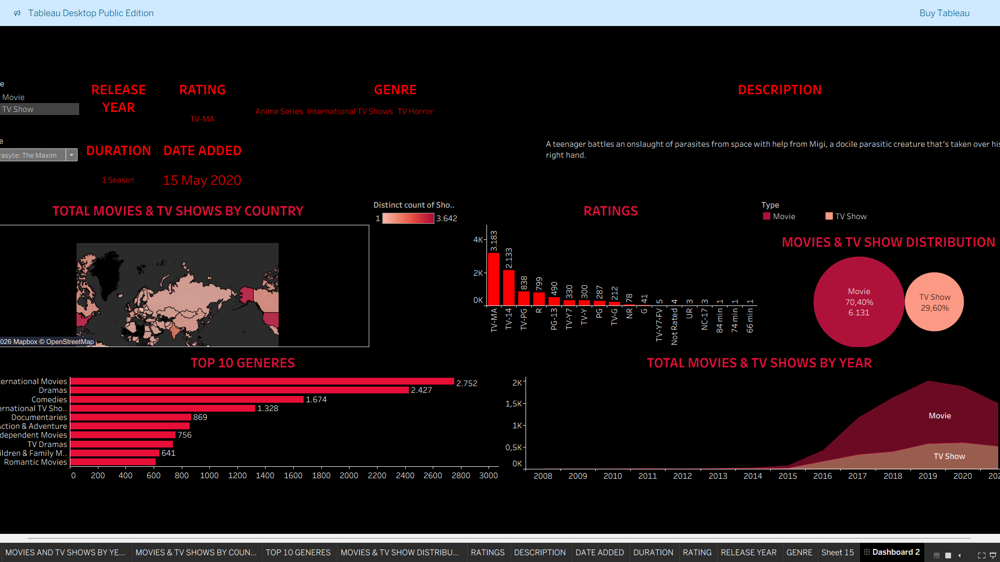

# netflix-data-analysis
## Project Overview
This project analyzes the Netflix dataset to uncover insights about content distribution, genres, ratings, and release trends.
The dataset was cleaned using Python and visualized using Tableau to build an interactive dashboard.

The goal of this project is to demonstrate the end-to-end data analysis workflow:
- Data cleaning
- Data transformation
- Data visualization
- Insight generation

---

## Tools & Technologies
- Python
- Tableau
- Pandas
- GitHub

---

## Data Cleaning
Data preprocessing was done using Python. The following steps were performed:

- Removed null values
- Standardized date formats
- Cleaned duration fields
- Created calculated fields for analysis
- Prepared the dataset for Tableau visualization

Python scripts used for cleaning can be found in the **python** folder.

---

## Dashboard Insights
The Tableau dashboard provides insights such as:

- Total number of Movies vs TV Shows
- Content distribution by country
- Top 10 genres on Netflix
- Content rating distribution
- Content release trend over the years
- Duration and date added analysis

These insights help understand Netflix's content strategy and global distribution.

---

## Dashboard Preview

---

## Repository Structure
---

## Key Skills Demonstrated
- Data Cleaning with Python
- Data Transformation using Pandas
- Interactive Dashboard Creation in Tableau
- Data Storytelling
- Version Control with GitHub

---

## Future Improvements
- Add interactive filters for deeper analysis
- Perform recommendation-based analysis
- Deploy dashboard using Tableau Public

---

## Author
Somnath Dutta
